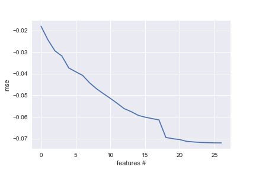
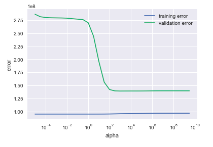
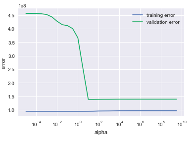
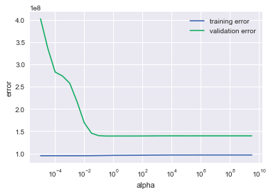

Online News Popularity
======================

Introduction
------------

One challenging part for social media is to attract readers. And one of
the most challenging part is to predict the number of shares in social
networks (popularity). Many factors affect the popularity and many may
not. My goal is to select most import factors and model to make dataset
easier and prediction more accurate.

Dataset
-------

I used the Online News Popularity Data Set from UCI Machine Learning
library
[here](http://archive.ics.uci.edu/ml/datasets/Online+News+Popularity#) .
The dataset contains *onlinenewspopularity.csv* with 61 features and
39644 observations.Features information:

    0. url: URL of the article (non-predictive) 
    1. timedelta: Days between the article publication and the dataset acquisition (non-predictive) 
    2. n_tokens_title: Number of words in the title 
    3. n_tokens_content: Number of words in the content 
    4. n_unique_tokens: Rate of unique words in the content 
    5. n_non_stop_words: Rate of non-stop words in the content 
    6. n_non_stop_unique_tokens: Rate of unique non-stop words in the content 
    7. num_hrefs: Number of links 
    8. num_self_hrefs: Number of links to other articles published by Mashable 
    9. num_imgs: Number of images 
    10. num_videos: Number of videos 
    11. average_token_length: Average length of the words in the content 
    12. num_keywords: Number of keywords in the metadata 
    13. data_channel_is_lifestyle: Is data channel 'Lifestyle'? 
    14. data_channel_is_entertainment: Is data channel 'Entertainment'? 
    15. data_channel_is_bus: Is data channel 'Business'? 
    16. data_channel_is_socmed: Is data channel 'Social Media'? 
    17. data_channel_is_tech: Is data channel 'Tech'? 
    18. data_channel_is_world: Is data channel 'World'? 
    19. kw_min_min: Worst keyword (min. shares) 
    20. kw_max_min: Worst keyword (max. shares) 
    21. kw_avg_min: Worst keyword (avg. shares) 
    22. kw_min_max: Best keyword (min. shares) 
    23. kw_max_max: Best keyword (max. shares) 
    24. kw_avg_max: Best keyword (avg. shares) 
    25. kw_min_avg: Avg. keyword (min. shares) 
    26. kw_max_avg: Avg. keyword (max. shares) 
    27. kw_avg_avg: Avg. keyword (avg. shares) 
    28. self_reference_min_shares: Min. shares of referenced articles in Mashable 
    29. self_reference_max_shares: Max. shares of referenced articles in Mashable 
    30. self_reference_avg_sharess: Avg. shares of referenced articles in Mashable 
    31. weekday_is_monday: Was the article published on a Monday? 
    32. weekday_is_tuesday: Was the article published on a Tuesday? 
    33. weekday_is_wednesday: Was the article published on a Wednesday? 
    34. weekday_is_thursday: Was the article published on a Thursday? 
    35. weekday_is_friday: Was the article published on a Friday? 
    36. weekday_is_saturday: Was the article published on a Saturday? 
    37. weekday_is_sunday: Was the article published on a Sunday? 
    38. is_weekend: Was the article published on the weekend? 
    39. LDA_00: Closeness to LDA topic 0 
    40. LDA_01: Closeness to LDA topic 1 
    41. LDA_02: Closeness to LDA topic 2 
    42. LDA_03: Closeness to LDA topic 3 
    43. LDA_04: Closeness to LDA topic 4 
    44. global_subjectivity: Text subjectivity 
    45. global_sentiment_polarity: Text sentiment polarity 
    46. global_rate_positive_words: Rate of positive words in the content 
    47. global_rate_negative_words: Rate of negative words in the content 
    48. rate_positive_words: Rate of positive words among non-neutral tokens 
    49. rate_negative_words: Rate of negative words among non-neutral tokens 
    50. avg_positive_polarity: Avg. polarity of positive words 
    51. min_positive_polarity: Min. polarity of positive words 
    52. max_positive_polarity: Max. polarity of positive words 
    53. avg_negative_polarity: Avg. polarity of negative words 
    54. min_negative_polarity: Min. polarity of negative words 
    55. max_negative_polarity: Max. polarity of negative words 
    56. title_subjectivity: Title subjectivity 
    57. title_sentiment_polarity: Title polarity 
    58. abs_title_subjectivity: Absolute subjectivity level 
    59. abs_title_sentiment_polarity: Absolute polarity level 
    60. shares: Number of shares (target)

Analysis
--------

I cut my data set into 2 parts. 10% for training and 90% for testing,
since 10% dataset have more than 3000 observations, which is enough. It
has one response, which is the number of shares. I'll try to reduce the
number of other features and fit a model to increase the accuracy of
prediction.

    data <- read.csv("data/onlinenewspopularity.csv")
    head(data)

    ##                                                              url timedelta
    ## 1   http://mashable.com/2013/01/07/amazon-instant-video-browser/       731
    ## 2    http://mashable.com/2013/01/07/ap-samsung-sponsored-tweets/       731
    ## 3 http://mashable.com/2013/01/07/apple-40-billion-app-downloads/       731
    ## 4       http://mashable.com/2013/01/07/astronaut-notre-dame-bcs/       731
    ## 5               http://mashable.com/2013/01/07/att-u-verse-apps/       731
    ## 6               http://mashable.com/2013/01/07/beewi-smart-toys/       731
    ##   n_tokens_title n_tokens_content n_unique_tokens n_non_stop_words
    ## 1             12              219       0.6635945                1
    ## 2              9              255       0.6047431                1
    ## 3              9              211       0.5751295                1
    ## 4              9              531       0.5037879                1
    ## 5             13             1072       0.4156456                1
    ## 6             10              370       0.5598886                1
    ##   n_non_stop_unique_tokens num_hrefs num_self_hrefs num_imgs num_videos
    ## 1                0.8153846         4              2        1          0
    ## 2                0.7919463         3              1        1          0
    ## 3                0.6638655         3              1        1          0
    ## 4                0.6656347         9              0        1          0
    ## 5                0.5408895        19             19       20          0
    ## 6                0.6981982         2              2        0          0
    ##   average_token_length num_keywords data_channel_is_lifestyle
    ## 1             4.680365            5                         0
    ## 2             4.913725            4                         0
    ## 3             4.393365            6                         0
    ## 4             4.404896            7                         0
    ## 5             4.682836            7                         0
    ## 6             4.359459            9                         0
    ##   data_channel_is_entertainment data_channel_is_bus data_channel_is_socmed
    ## 1                             1                   0                      0
    ## 2                             0                   1                      0
    ## 3                             0                   1                      0
    ## 4                             1                   0                      0
    ## 5                             0                   0                      0
    ## 6                             0                   0                      0
    ##   data_channel_is_tech data_channel_is_world kw_min_min kw_max_min
    ## 1                    0                     0          0          0
    ## 2                    0                     0          0          0
    ## 3                    0                     0          0          0
    ## 4                    0                     0          0          0
    ## 5                    1                     0          0          0
    ## 6                    1                     0          0          0
    ##   kw_avg_min kw_min_max kw_max_max kw_avg_max kw_min_avg kw_max_avg
    ## 1          0          0          0          0          0          0
    ## 2          0          0          0          0          0          0
    ## 3          0          0          0          0          0          0
    ## 4          0          0          0          0          0          0
    ## 5          0          0          0          0          0          0
    ## 6          0          0          0          0          0          0
    ##   kw_avg_avg self_reference_min_shares self_reference_max_shares
    ## 1          0                       496                       496
    ## 2          0                         0                         0
    ## 3          0                       918                       918
    ## 4          0                         0                         0
    ## 5          0                       545                     16000
    ## 6          0                      8500                      8500
    ##   self_reference_avg_sharess weekday_is_monday weekday_is_tuesday
    ## 1                    496.000                 1                  0
    ## 2                      0.000                 1                  0
    ## 3                    918.000                 1                  0
    ## 4                      0.000                 1                  0
    ## 5                   3151.158                 1                  0
    ## 6                   8500.000                 1                  0
    ##   weekday_is_wednesday weekday_is_thursday weekday_is_friday
    ## 1                    0                   0                 0
    ## 2                    0                   0                 0
    ## 3                    0                   0                 0
    ## 4                    0                   0                 0
    ## 5                    0                   0                 0
    ## 6                    0                   0                 0
    ##   weekday_is_saturday weekday_is_sunday is_weekend     LDA_00     LDA_01
    ## 1                   0                 0          0 0.50033120 0.37827893
    ## 2                   0                 0          0 0.79975569 0.05004668
    ## 3                   0                 0          0 0.21779229 0.03333446
    ## 4                   0                 0          0 0.02857322 0.41929964
    ## 5                   0                 0          0 0.02863281 0.02879355
    ## 6                   0                 0          0 0.02224528 0.30671758
    ##       LDA_02     LDA_03     LDA_04 global_subjectivity
    ## 1 0.04000468 0.04126265 0.04012254           0.5216171
    ## 2 0.05009625 0.05010067 0.05000071           0.3412458
    ## 3 0.03335142 0.03333354 0.68218829           0.7022222
    ## 4 0.49465083 0.02890472 0.02857160           0.4298497
    ## 5 0.02857518 0.02857168 0.88542678           0.5135021
    ## 6 0.02223128 0.02222429 0.62658158           0.4374086
    ##   global_sentiment_polarity global_rate_positive_words
    ## 1                0.09256198                 0.04566210
    ## 2                0.14894781                 0.04313725
    ## 3                0.32333333                 0.05687204
    ## 4                0.10070467                 0.04143126
    ## 5                0.28100348                 0.07462687
    ## 6                0.07118419                 0.02972973
    ##   global_rate_negative_words rate_positive_words rate_negative_words
    ## 1                0.013698630           0.7692308           0.2307692
    ## 2                0.015686275           0.7333333           0.2666667
    ## 3                0.009478673           0.8571429           0.1428571
    ## 4                0.020715631           0.6666667           0.3333333
    ## 5                0.012126866           0.8602151           0.1397849
    ## 6                0.027027027           0.5238095           0.4761905
    ##   avg_positive_polarity min_positive_polarity max_positive_polarity
    ## 1             0.3786364            0.10000000                   0.7
    ## 2             0.2869146            0.03333333                   0.7
    ## 3             0.4958333            0.10000000                   1.0
    ## 4             0.3859652            0.13636364                   0.8
    ## 5             0.4111274            0.03333333                   1.0
    ## 6             0.3506100            0.13636364                   0.6
    ##   avg_negative_polarity min_negative_polarity max_negative_polarity
    ## 1            -0.3500000                -0.600            -0.2000000
    ## 2            -0.1187500                -0.125            -0.1000000
    ## 3            -0.4666667                -0.800            -0.1333333
    ## 4            -0.3696970                -0.600            -0.1666667
    ## 5            -0.2201923                -0.500            -0.0500000
    ## 6            -0.1950000                -0.400            -0.1000000
    ##   title_subjectivity title_sentiment_polarity abs_title_subjectivity
    ## 1          0.5000000               -0.1875000             0.00000000
    ## 2          0.0000000                0.0000000             0.50000000
    ## 3          0.0000000                0.0000000             0.50000000
    ## 4          0.0000000                0.0000000             0.50000000
    ## 5          0.4545455                0.1363636             0.04545455
    ## 6          0.6428571                0.2142857             0.14285714
    ##   abs_title_sentiment_polarity shares
    ## 1                    0.1875000    593
    ## 2                    0.0000000    711
    ## 3                    0.0000000   1500
    ## 4                    0.0000000   1200
    ## 5                    0.1363636    505
    ## 6                    0.2142857    855

I cut the column of 'url' and 'shares'. Therefore, we have data summary
as

    Number of training examples: 3964
    Number of features: 59

I fit *sklearn.linear\_model.Ridge* model to record the training score
and validation score for initial dataset.

    Training score:   0.0421
    Validation score: -0.344

### Feature selection

I wrote *ForwardSelection()* function to search the best features for a
given dataset.

    fs = ForwardSelection(Ridge())
    fs.fit(Xtrain,ytrain)
    print('features: {}'.format(fs.ftr_))
    print('score: {}'.format(fs.score_))

    features: [8, 31, 1, 9, 7, 14, 16, 39, 17, 19, 50, 45, 0, 2, 15, 42, 12, 10, 4, 33, 53, 47, 46, 48, 18, 56, 51]
    score: -0.07203325084218193

We got the column number for the feature and our score is -0.07, which
is higher than the initial dataset.

This plot interprate the relationship between error and the number of
feature selection. When number of features is greater than 27, the error
will not change anymore.

### Model selection

After the feature selection, we will do model selection. I wrote a
funtion *err\_plot()* to output the error rate and plot.

For *Ridge* model:

for *Lasso* model:

for *ElasticNet* model:

We find the best model is ElasticNet with alpha = 0.316.

Conclusion:
-----------

Let's compare results: For initial dataset:

    Training score:   0.0421
    Validation score: -0.344

For reduced dataset:

    Training score:   0.0114
    Validation score: 0.00263

We have higher scores and lower number of features.
